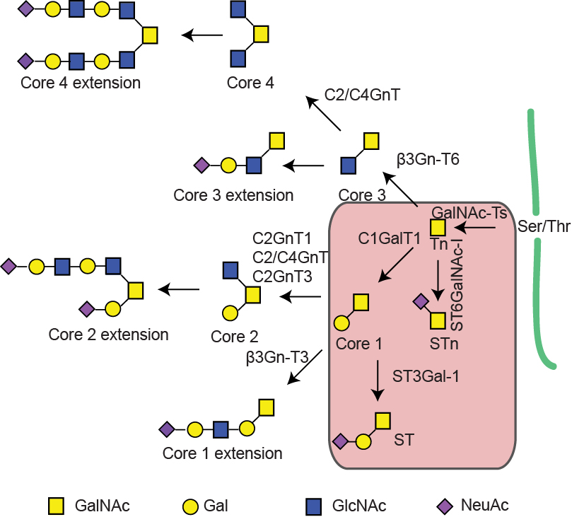
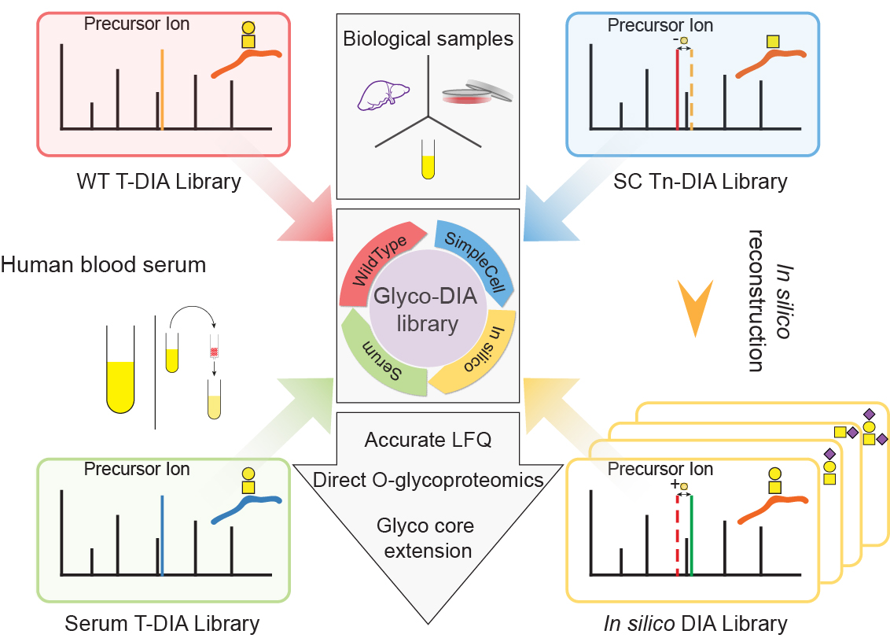

# Glyco-DIA
Here is the repository for Glyco-DIA.

The Glyco-DIA library consists of sublibraries obtained from human cell lines and human serum, and it currently covers 2,076 O-glycoproteins (11,452 unique glycopeptide sequences) and the five most common core1 O-glycan structures. Applying the Glyco-DIA library to human serum without enrichment for glycopeptides enabled us to identify and quantify 269 distinct glycopeptide sequences bearing up to 5 different core1 O-glycans from 159 glycoproteins in a singleshot analysis. The DIA method is expandable and widely applicable to different glycoproteomes, and it may represent a first step towards direct and comprehensive approach to glycoproteomics. 

## O-glycosylation pathways

## Glyco-DIA libraries

### Library description

| Library  | Description |
| ------------- | ------------- |
| HEK_SC_Comprehensive  | Multiple MS runs (high pH reverse phase fractionated) in HCD-MS2 DDA mode, LWAC VVA enriched samples from HEK SC|
| HEK_SC_Single_SingleRun | Single MS run in HCD-MS2 DDA mode, LWAC VVA enriched samples from HEK SC |
| HEK_WT_Comprehensive	| Multiple MS runs (high pH reverse phase fractionated) in HCD-MS2 DDA mode, LWAC Jacalin enriched samples from HEK293 WT |
| HepG2_SC_Comprehensive |	Multiple MS runs (high pH reverse phase fractionated) in HCD-MS2 DDA mode, LWAC VVA enriched samples from HepG2 SC |
| HepG2_SC_Secretome_SingleRun |	Single MS run in HCD-MS2 DDA mode, LWAC VVA enriched samples from HEK SC secretome |
| HepG2_SC_SingleRun |	Single MS run in HCD-MS2 DDA mode, LWAC VVA enriched samples from HEK SC |
| HepG2_WT_Comprehensive |	Multiple MS runs (high pH reverse phase fractionated) in HCD-MS2 DDA mode, LWAC Jacalin enriched samples from HepG2 WT |
| HepG2_WT_SingleRun |	Single MS run in HCD-MS2 DDA mode, LWAC Jacalin enriched samples from HepG2 WT |
| M3T4_SC_Comprehensive |	Multiple MS runs (high pH reverse phase fractionated) in HCD-MS2 DDA mode, LWAC VVA enriched samples from M3T4 SC |
| OVCAR3_SC_Comprehensive |	Multiple MS runs (high pH reverse phase fractionated) in HCD-MS2 DDA mode, LWAC VVA enriched samples from OVCAR3 SC |
| Serum_DIA_Comprehensive |	Multiple MS runs (with and without Top2 depletion, high pH reverse phase fractionated) in HCD-MS2 DDA mode, LWAC Jacalin enriched samples from human serum |
| Serum_SiteSpecific |	Single MS run in ETD/HCD-MS2 DDA mode, LWAC Jacalin enriched samples from human serum |

## in silico library generation

The R script for in silico library generation is at `R/in silico Library.R` and the related example file is at `test/test_Tn.xls`
